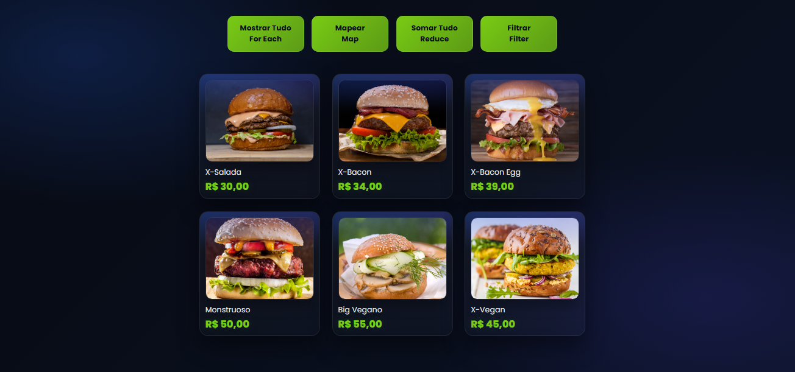

# 🍔 Burger Menu JS

Projeto de cardápio interativo desenvolvido com JavaScript.

## 🚀 Funcionalidades

- Mostrar todos os produtos (forEach)
- Aplicar desconto (map)
- Somar valores (reduce)
- Filtrar opções veganas (filter)

## 🛠️ Tecnologias

- HTML
- CSS
- JavaScript

## 📸 Preview

